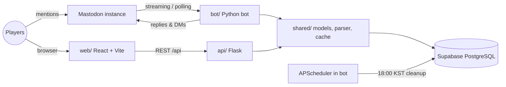

# Trashpit

> Inventory and combat system for a Mastodon-based tabletop RPG community: players manage their items by mentioning a bot, and see and rearrange their bag in a drag-and-drop web UI. Both use the same Supabase database.

## Features

- **Mastodon bot commands**: acquire, use, discard, transfer, buy items, and check your status by mentioning the bot, e.g. `[사용/사과]` or `[양도/사과/엘리사]`. Admins can grant items, adjust points, and change stats.
- **Three-zone inventory**: a volume-limited **bag** (capacity scales with strength: 20 / 40 / 60, or 200 at strength 50), an unlimited **free space** zone for zero-volume items, and a **nearby** zone for newly acquired items. The nearby zone is cleared every day at 18:00 KST.
- **Dice-driven effects and combat**: items apply stat changes from dice expressions such as `1d6+3`. HP always stays between 0 and its maximum (health × 10). Attack and shoot damage depends on the character's faction and strength plus a random roll. Defense scales with health, and dodge is a random success check.
- **Drag-and-drop bag grid**: the React UI shows each item as a multi-cell shape sized by its volume. Players drag items between zones or onto a trash zone, then save the new layout through the API.
- **Safe concurrent updates**: each character has its own lock, shared by buy, transfer, and use. Transfers take both characters' locks in a fixed order to avoid deadlocks, and roll back if adding the item to the receiver fails.
- **Per-character access links**: `[가방 링크]` sends the player a signed, expiring link by DM. The API accepts inventory reads and writes only for the character named in the link (see [Security](#security)).
- **Resilient bot loop**: the bot listens on Mastodon streaming with automatic reconnects and switches to polling after repeated failures. On startup it skips notifications that arrived before it started, and it sends players direct messages when they receive items.

## Tech Stack

| Area | Technology |
| --- | --- |
| Bot | Python 3, Mastodon.py (streaming + polling), APScheduler |
| API | Flask, flask-cors, gunicorn |
| Database | Supabase (PostgreSQL), with a SQL RPC for atomic item use |
| Web | React 18, TypeScript, Vite, Tailwind CSS 4, react-dnd, Radix UI |
| Testing | pytest |
| Deployment | Railway (API, via `Procfile`), Vercel (web, via `web/vercel.json`) |

## Architecture



- `shared/` holds the logic that the bot and the API both use: the Supabase client, the inventory JSON parser, capacity rules, the item master cache, and a TTL cache.
- The bot and the API never call each other. They stay in sync through the database, and the web client polls the API for changes.
- Item use goes through a PostgreSQL function (`sql/use_item_transaction.sql`) when it is installed, so removing the item and changing the stat happen atomically. Without the function, the bot removes the item, applies the stat change, and puts the item back if the stat update fails.

## Security

The web UI has no accounts, so the API authorizes requests with **signed per-character links**:

1. A player mentions the bot with `[가방 링크]`. The bot looks up the character owned by that Mastodon account and replies **by direct message only**, whatever the visibility of the request.
2. The link carries a token `base64url({"n": name, "exp": …}).HMAC-SHA256(secret, payload)` signed with `INVENTORY_LINK_SECRET`, which is shared by the bot and the API and never sent to the browser. Links expire after `INVENTORY_LINK_TTL_DAYS` days, and rotating the secret revokes all of them.
3. The token travels in the URL **fragment** (`/#token=…`), which browsers never send to the web host. The web app moves it into `sessionStorage` (so it doesn't linger in the address bar or history) and sends it as `X-Character-Token`.
4. Every `/api/character`, `/api/bag` and `/api/nearby` route verifies the signature and expiry with a constant-time comparison, and checks that the token's character matches the `<name>` in the path. It returns 401 or 403 before touching the database.
5. `/api/admin/*` requires `Authorization: Bearer <ADMIN_API_TOKEN>`. If the secrets are not configured, the protected routes fail closed with 503.

## Getting Started

### Prerequisites

- Python 3.11+ (developed on 3.13)
- Node.js 18+ (`web/package.json` pins `24.x` for Vercel)
- A Supabase project with `characters` and `items` tables (schema below)
- A Mastodon bot account and its access token

### Installation

```bash
git clone https://github.com/eden-chang/mas-cm-trashpit.git
cd mas-cm-trashpit

pip install -r requirements.txt
cp .env.example .env          # fill in Supabase and Mastodon values

cd web
npm ci
cp .env.example .env          # optional: point the web client at a deployed API
```

### Database schema

`characters`: `name` (PK), `id` (Mastodon account), `side`, `con`, `str`, `luck`, `hp`, `points`, and the JSONB columns `bag`, `misc`, `around`, `arrange` (grid layout).

`items`: `name` (PK), `price` (number or `비매품`, meaning not for sale), `description`, `use_script`, `change_stats`, `change_value` (dice expression), `size` (volume).

The migration `scripts/migrations/001_add_updated_at.sql` adds `updated_at` tracking, and `sql/use_item_transaction.sql` defines the atomic item-use RPC.

## Environment Variables

Backend (`.env` at the repo root):

| Variable | Description | Example |
| --- | --- | --- |
| `SUPABASE_URL` | Supabase project URL (required) | `https://your-project.supabase.co` |
| `SUPABASE_SERVICE_KEY` | Supabase service role key (required) | `your_service_role_key` |
| `MASTODON_API_BASE_URL` | Mastodon instance URL (required) | `https://your-instance.example` |
| `BOT_ACCESS_TOKEN` | Bot account access token (required) | `your_bot_access_token` |
| `SYSTEM_ADMIN_ID` | Comma-separated admin account names | `admin1,admin2` |
| `POLLING_INTERVAL` | Polling interval in seconds when streaming is unavailable | `30` |
| `LOG_LEVEL` / `DEBUG_MODE` | Logging verbosity | `INFO` / `False` |
| `FLASK_DEBUG`, `API_HOST`, `API_PORT` | Flask dev server settings | `False`, `0.0.0.0`, `5000` |
| `CORS_ORIGINS` | Comma-separated allowed origins | `*` |
| `CACHE_TTL`, `CACHE_TTL_ITEMS`, `CACHE_TTL_CHARACTERS` | Cache lifetimes in seconds | `60`, `300`, `30` |
| `INVENTORY_LINK_SECRET` | Signing key for per-character links, shared by the bot and API (32+ random characters; required for the inventory API) | `openssl rand -hex 32` |
| `INVENTORY_WEB_URL` | Web app URL used in links sent by the bot | `https://your-inventory.example` |
| `INVENTORY_LINK_TTL_DAYS` | Link lifetime in days | `30` |
| `ADMIN_API_TOKEN` | Bearer token for `/api/admin/*` (32+ random characters) | `openssl rand -hex 32` |

Web (`web/.env`):

| Variable | Description | Example |
| --- | --- | --- |
| `VITE_API_BASE_URL` | API base URL. Leave empty in development to use the Vite `/api` proxy to `localhost:5000` | `https://your-api.example` |

## Usage

```bash
python -m bot.main              # run the Mastodon bot (includes the daily cleanup scheduler)
python -m api.app               # run the Flask API on :5000
cd web && npm run dev           # run the web UI with a proxy to the API
cd web && npm run build         # production build into web/dist
```

Bot commands (sent as a mention to the bot):

| Command | Action |
| --- | --- |
| `[획득/아이템]` | Acquire an item into the nearby zone |
| `[사용/아이템]` | Use an item and apply its stat effect |
| `[버리기/아이템]` | Discard an item |
| `[양도/아이템, 아이템/캐릭터]`, `[양도/10포인트/캐릭터]` | Transfer items or points to another character |
| `[상점]`, `[구매/아이템/개수]`, `[설명/아이템]` | List the shop, buy items, show item details |
| `[상태 확인]` | Show your stats, points, HP, and bag usage |
| `[가방 링크]` | Receive your personal inventory web link by DM |
| `[hp/+5]`, `[근력/-1]`, `[체력/…]`, `[행운/…]` | Change a stat (clamped to valid ranges) |
| `[공격]`, `[방어]`, `[회피]`, `[발사]` | Combat rolls: attack, defense, dodge, shoot |
| `[지급/아이템/캐릭터]`, `[포인트 추가/…]`, `[포인트 차감/…]` | Admin only: grant items and adjust points |

API endpoints:

| Method | Path | Description |
| --- | --- | --- |
| GET | `/health` | Health check |
| GET | `/api/characters` | List characters |
| GET | `/api/character/<name>` | Character detail with inventory (link token required) |
| GET / POST | `/api/bag/<name>` | Read or save bag contents and grid layout (link token required) |
| GET | `/api/nearby/<name>`, POST `/api/nearby/<name>/move` | Read nearby items or move them into the bag (link token required) |
| GET | `/api/items`, `/api/item/<name>` | Item master data |
| GET / POST | `/api/admin/cache/stats`, `/cache/clear`, `/cache/cleanup`, `/characters/refresh` | Cache administration (admin token required) |

## Testing

```bash
python -m pytest
```

Unit tests mock Supabase and Mastodon, so they run without a `.env`. `tests/conftest.py` supplies placeholder settings. Integration tests that write to a real Supabase project are skipped unless you set `ENABLE_BOT_SUPABASE_TESTS=true` or `ENABLE_WRITE_TESTS=true` together with the `TEST_*` variables in `.env.example`.

## Project Structure

```
.
├── bot/            Mastodon bot: command handlers, services, scheduler, notifications
│   ├── commands/   One module per command (use, transfer, buy, attack, ...)
│   ├── services/   Character, inventory, item, transaction, and combat logic
│   └── utils/      Dice, locking, validation, Korean particle helpers
├── api/            Flask REST API (routes/ and services/)
├── shared/         Code shared by the bot and the API: Supabase client, parser, capacity, cache
├── web/            React + Vite frontend (bag grid, free space, nearby tabs)
├── sql/            PostgreSQL function for atomic item use
├── scripts/        Maintenance and manual test scripts (cleanup, cache sync, data checks)
├── tests/          pytest suite (unit tests under tests/unit/)
├── docs/           Design documents for each phase (in Korean)
├── Procfile        gunicorn entry point for the API
└── requirements.txt
```

## Design Docs

`docs/` holds the planning documents in Korean, written phase by phase: overview (Phase 0), data design (1), bot (2), API (3), web frontend (4), automation (5), and testing/deployment (6). It also has shared rules, permission and exception-handling specs, and the original game design notes (`docs/idea.md`).
